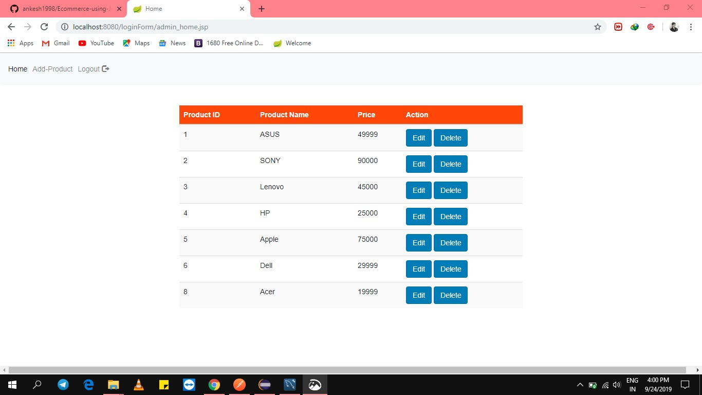
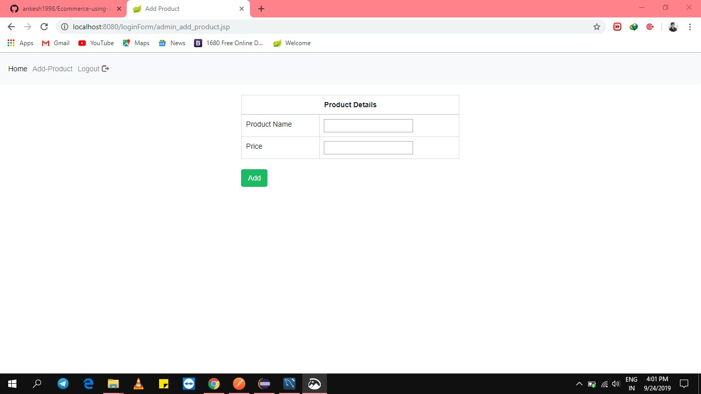
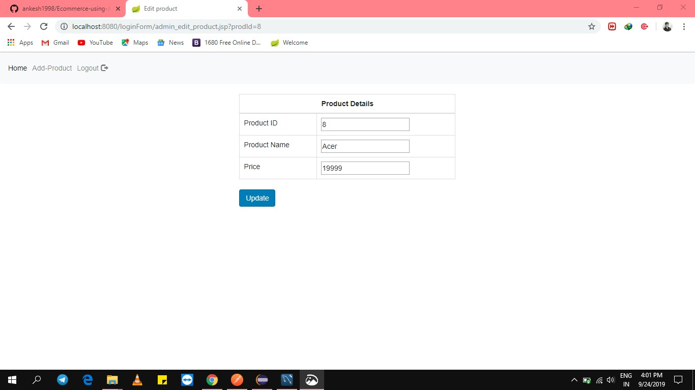
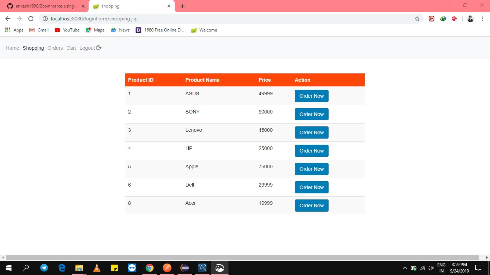
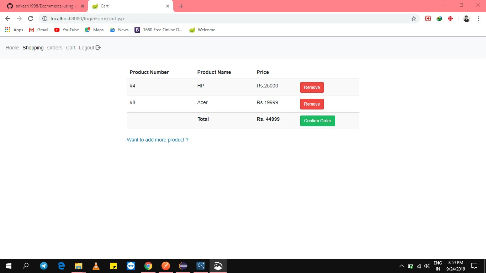
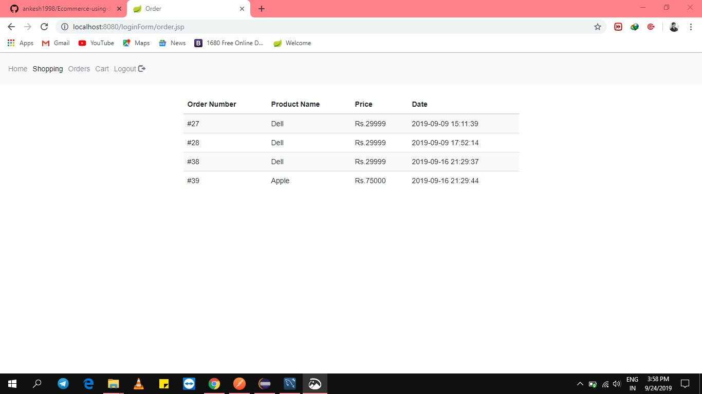

# Ecommerce-using-Jsp-Servlet
This consists of Admin module also where admin can ADD/EDIT/DELETE the products by login through their credentials.

One more thing is that both the "customers" and "admin" can login through the same login page and
depending on thier user-type(admin/customer) we are redirecting them to corresponding pages.

Features are :

              1. Forgot password:
                                Customer Or Admin both are allowed to forgot password with the help of thier previous contact.
              2. Customer registration: 
                                      If the customer already exits with the same contact then we won't allow him.
                                      and we also validating contact like-it should be of ten digits 
              3. Cart Page:
                           Whatever the items that the customer added in his cart it will be shown there.
                           The customer can also be able to remove the product which are present in his cart and add new one.
              4. Order Page:
                            This will contain the records of all the orders which are done by the customer.
                     

     

              
